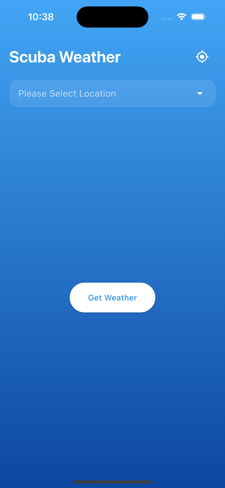
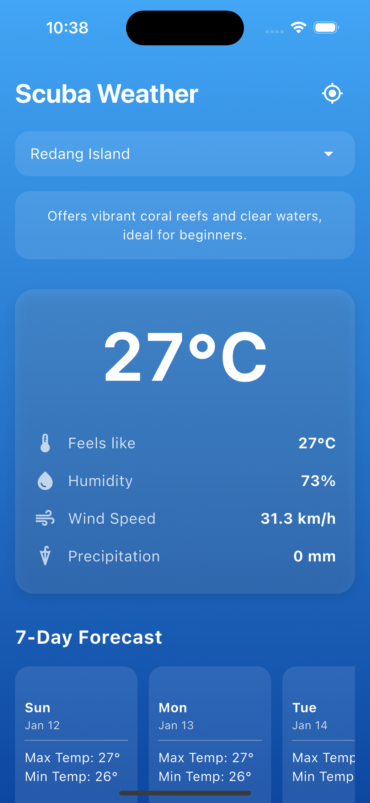

# Scuba Weather App

A Flutter weather application specifically designed for scuba diving locations in Malaysia, featuring real-time weather data from Open-Meteo API.

## Screenshots

<p float="left">
  
  
</p>

## Features

- 🌡️ Real-time weather data including:
  - Temperature
  - Feels-like temperature
  - Humidity levels
  - Wind speed
  - Precipitation
- 📍 Location support:
  - Current location detection
- 🏗️ Clean Architecture implementation
- 📱 Material Design 3 UI components
- 🔄 State Management using Flutter Bloc (Cubit)

## Technical Stack

- **Flutter & Dart**: Core framework and programming language
- **flutter_bloc**: State management using Cubit pattern
- **Open-Meteo API**: Free weather data provider
- **geolocator**: Location services
- **http**: API communication
- **equatable**: Value equality comparison

## Architecture

The project follows Clean Architecture principles with the following layers:

```bash
lib/
├── models/         # Data models
├── repositories/   # Data sources and API handling
├── cubits/         # Business logic and state management
└── screens/        # UI components
```

## State Management

The app uses the Cubit pattern (part of flutter_bloc) for state management, providing:
- Clear separation of concerns
- Predictable state updates
- Easy testing capabilities
- Efficient rebuilds

## Platform Support

- ✅ Android
- ✅ iOS

## Future Improvements

- [ ] Add more diving locations in Malaysia
- [x] Implement weather forecasting
- [ ] Add water temperature data
- [ ] Include tide information
- [ ] Save favorite locations
